**Chinese Spam Message Classification**

Data Science for Cyber Security Final Project

Ching-Chih Tsao 

**Introduction**

自從疫情開始後，許多人經常收到垃圾簡訊，如果要有效阻隔垃圾簡訊傳播，第一步便是使用分類模型判斷一條簡訊是否為垃圾簡訊。之前的作業中使用了比較經典的英文簡訊資料集來完成SMS spam classification，因此期末報告選擇延伸此課題實作中文的垃圾簡訊分類模型，並比較不同模型間的分類成效。

**Methodology**

- Overall Process 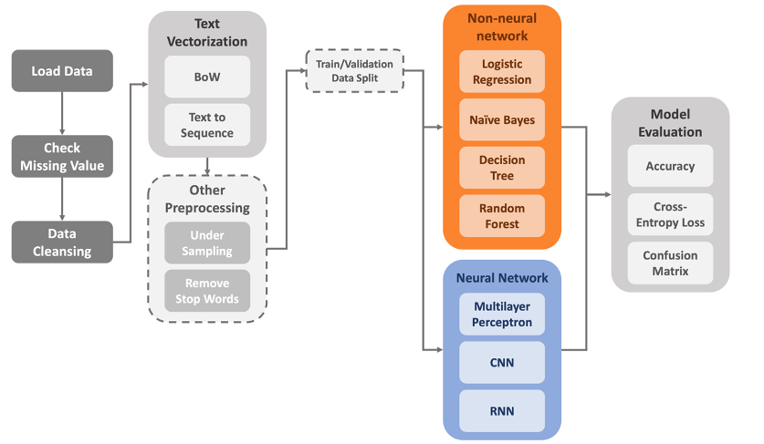
- Dataset

在尋找資料集的過程中發現中文簡訊的公開資料集明顯相較英文少了許多，最終選擇了一個叫做mudou\_spam的中國垃圾簡訊資料集[1]，其資料使用文字檔(.txt)紀錄，每一筆資料共有三個欄位，分別是：垃圾簡訊標記結果(0, 1)、簡訊內容、斷詞結果，中間以Tab鍵("\t")隔開（圖1）。原始資料訓練集共有10872筆，測試集共有1382筆資料，經過檢查後發現部分缺失值，但數量不多，因此直接將其移除，清理後資料分佈如表1，垃圾簡訊與非垃圾簡訊的比例約為16:9，有些許不平衡。

表1: 資料分佈

|| **Ham (0)** | **Spam (1)** |**Total** |
| --- | --- | --- | --- |
| Train | 3933 | 6899 | 10832 |
| Test | 491 | 888 | 1379 |

圖1: 資料集部分截圖

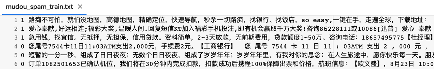

圖2: 讀取資料與資料清理實作程式碼 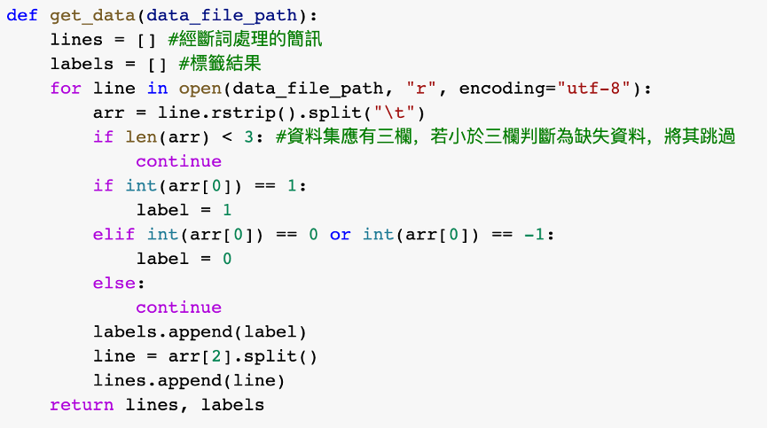

- Preprocessing

本次報告中主要使用了兩種不同方法將文本轉為向量，

1. Bag-of-words: 將斷詞文字建立為字典，統計所有字詞出現的次數，刪除出現次數\<5的詞彙，可以得到含有6012個單詞的詞典，再將每則簡訊是否有出現某單詞分別寫成6012維的向量，以訓練集為例，最終得到 (10832, 6012) 的訓練集矩陣。

圖3:Bag-of-words實作程式碼

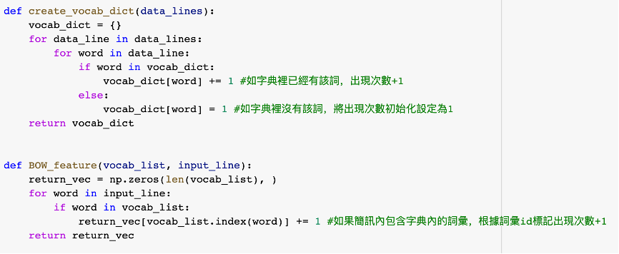

1. 因為後續測試會使用RNN，因此也實作了考慮文字順序的方法，並且只統計垃圾簡訊字詞出現的次數，同樣刪除出現次數\<5的詞彙後，得到含有4632個單詞對應出現次數的垃圾簡訊詞典，再將每則簡訊依照斷詞順序查找是否有出現在垃圾簡訊詞典，寫入對應分數。使用時搭配sequence.pad\_sequences(train\_X, maxlen=50)，將簡訊矩陣限制成同一長度的資料，最終得到 (10832, 50) 的訓練集矩陣。

圖4:Text to Sequence實作程式碼

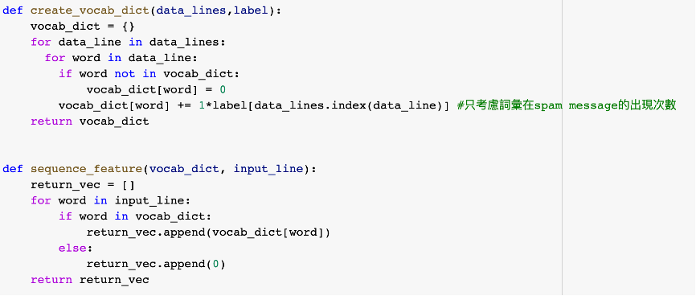

除以上兩種文本轉向量的方法外，因為觀察到資料集有些許不平衡且原資料有將標點符號、數字納入詞典的狀況，在資料預處理上還做了under sampling與排除stop words的嘗試，搭配此兩種文本轉向量的方法使用，並比較其訓練成效，其中stop words採用github上goto456提供的中文停用詞表，共有746個停用詞。[2]

圖5:Under Sampling實作程式碼

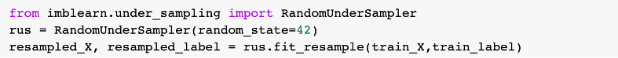

圖6:排除Stop Words實作程式碼

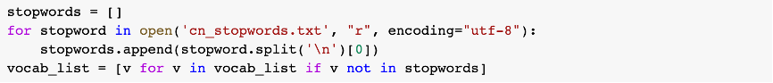

- Algorithms

因為垃圾簡訊分類屬於二元分類問題，在本次報告中分別從non-neural network與neural network兩種大分類挑選了總共七種演算法進行比較。在non-neural network中挑選了四種常用演算法，分別是：資料集作者使用的Logistic Regression、比較經典的分類問題演算法Naïve Bayes、能看到判斷節點的Decision Tree、以及決策樹的升級版Random Forest。而在neural network中則挑選了三種神經網路模型，分別是Multilayer Perceptron、CNN以及常用於文本分析的RNN。

Non-neural network的模型使用scikit-learn建立，程式碼如下。

圖7:Logistic Regression實作程式碼

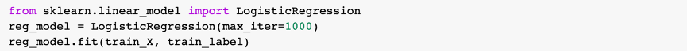

圖8:Naïve Bayes實作程式碼

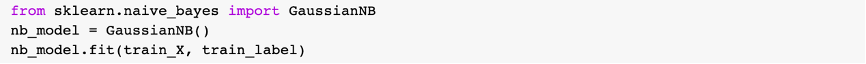

在Decision Tree的max\_depth設定上，測試了max\_depth = 6~15的結果，使用驗證集驗證後得到Best Max Depth = 10，因此使用max\_depth = 10建立Decision Tree。

圖9:Decision Tree實作程式碼

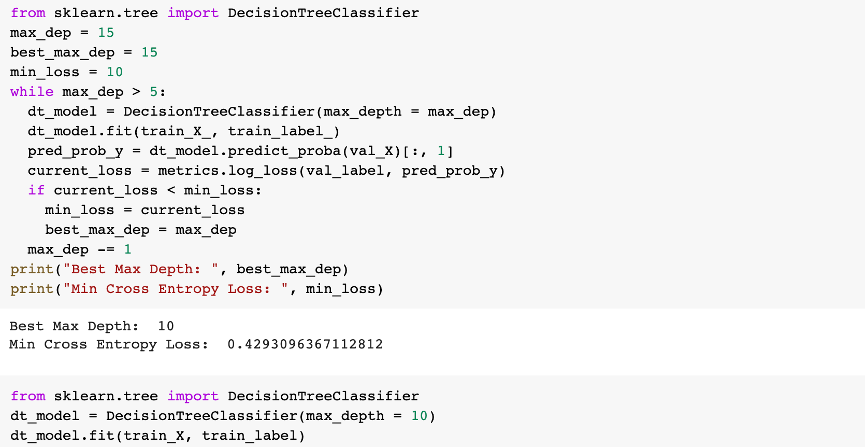

Random Forest則測試了樹的數量(n\_estimators)設定，測試了max\_depth = 100~1000的結果，實測發現n\_estimators在100到200間效果有明顯差異，n\_estimators \> 200後，訓練成效成長趨緩但有一些波動，而在n\_estimators = 200時模型的loss剛好能夠達到與n\_estimators = 1000相差無幾的水準，綜合考量訓練時間與訓練效果，最終將n\_estimators設定為200。

圖10:Random Forest實作程式碼 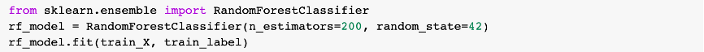

Neural network的模型使用scikit-learn與tensorflow建立，程式碼如下。在模型設計上，CNN使用Conv1D搭配全連接層，RNN使用LSTM搭配Dropout防止Overfitting，激發函數混合使用Sigmoid和ReLU，optimizer則是選擇Adam。訓練時則搭配使用Early Stopping與Model Checkpoint，防止過度訓練耗時又容易造成過擬和。

圖11:MLP實作程式碼

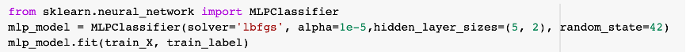

圖12:CNN實作程式碼 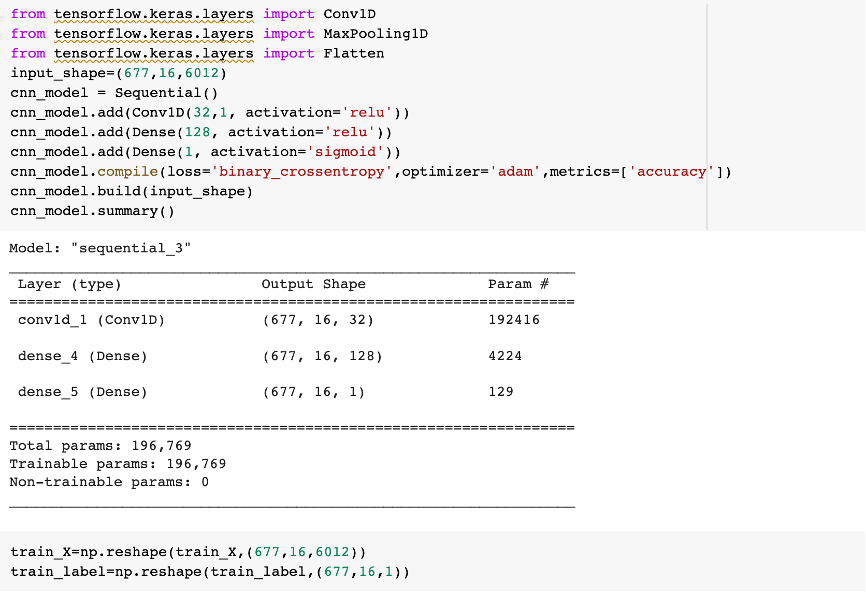

圖13:RNN (LSTM) 實作程式碼

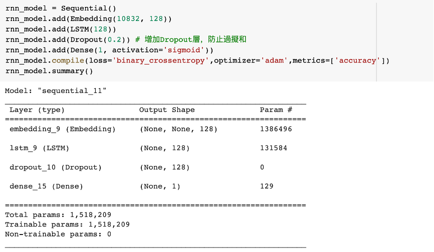

- Evaluation

本報告使用Cross Entropy Loss與Test Accuracy評估模型，搭配Confusion Matrix查看不同模型間判斷結果的差異。

**Result**

- Best Model

在演算法分類效果的比較中，因為模型參數設定與使用的訓練資料處理方式不同會導致模型相關數據不同，所以首先比較各演算法成效最好的模型。在非神經網路的模型中，表現較好的是Logistic Regression與Random Forest（表2），而在神經網路的模型中，RNN的Cross-Entropy Loss較低，而MLP則有比較好的準確度表現。（表3）

表2: Non-neural Network Best Model分類效果比較

|| **Logistic Regression** | **Decision Tree** | **Random Forest** | **Naïve Bayes** |
| --- | --- | --- | --- | --- |
| Accuracy | 0.9637 | 0.9007 | 0.9681 | 0.9275 |
| Cross-Entropy Loss | 0.1137 | 0.3371 | 0.1200 | 2.5046 |

圖14:Non-neural Network Confusion Matrix

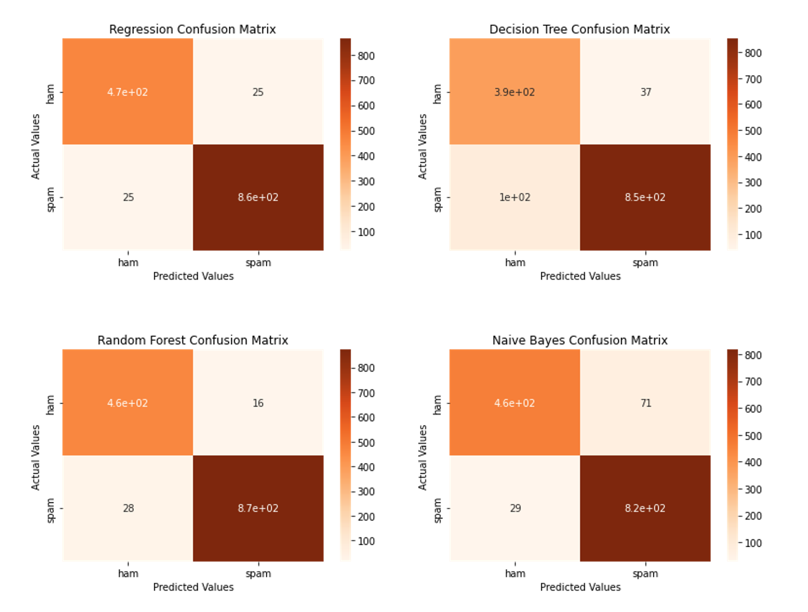

表3: Neural Network Best Model分類效果比較

|| **MLP** | **CNN** | **RNN** |
| --- | --- | --- | --- |
| Accuracy | 0.9608 | 0.9564 | 0.9347 |
| Cross-Entropy Loss | 0.6117 | 0.3267 | 0.1671 |

圖15:Neural Network Confusion Matrix

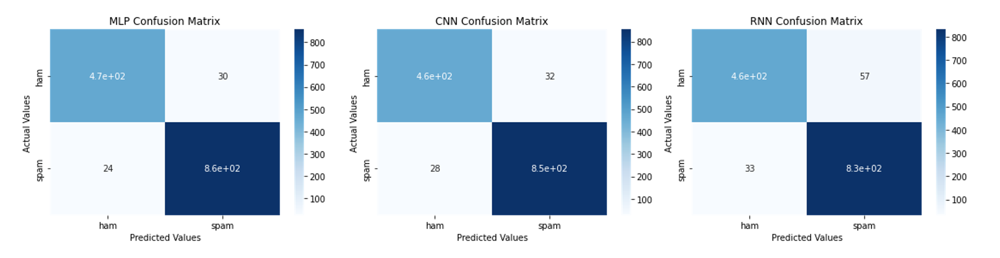

值得注意的是，在這個資料集上，神經網路模型相較於非神經網路模型並沒有特別突出的表現，雖然這有可能是因為神經網路參數並沒有調整到最佳狀態，但也說明了非神經網路在模型表現上並不一定總是遜於神經網路，還是要視資料與模型設計而定。

接著比較文本轉向量的方法，所有報告中的模型，只有RNN在使用Text-to-Sequence的時候表現比較好，其他模型皆是使用Bag-of-Words進行文本向量轉換效果較好。（表4）推測可能是因為兩種方法的資料維度相差太多，而non-neural network又比較仰賴大量資料變數，因此較不適合Text-to-Sequence的處理方式。在四種non-neural network的模型中，只有Random Forest表現較不受影響，可能與其本身模型結構較不依賴資料變數（樹的深度）有關。

表4: Non-neural Network文本轉向量方法比較

||| **Logistic Regression** | **Decision Tree** | **Random Forest** | **Naïve Bayes** |
| --- | --- | --- | --- | --- | --- |
| Accuracy | BoW | 0.9637 | 0.9007 | 0.9681 | 0.9275 |
|| Text2Sequence | 0.7194 | 0.8593 | 0.9108 | 0.6940 |
| Cross-Entropy Loss | BoW | 0.1137 | 0.3371 | 0.1200 | 2.5046 |
|| Text2Sequence | 0.5522 | 1.2981 | 0.2168 | 2.0788 |

最後比較兩種資料預處理的方式，分別是Under Sampling與Remove Stop Words，其中Under Sampling會使資料筆數縮減到7866筆，得到(7866, 6012)的訓練集矩陣，而Remove Stop Words則會使詞袋中詞數減少5759，得到(10832, 5759)的訓練集矩陣。可以發現不管是Under Sampling或是Stop Words Removement，對模型效果的提升並沒有太大幫助（表5, 表6），這可能是因為這兩種預處理方式都會導致資料維度縮減而損失一定的原始資料。在Logistic Regression的測試中，Stop Words Removement能夠小幅提升模型效果（表6），顯示資料集中確實存在應移除的停用詞，但此次只測試了一種停用詞表，且並不是專為垃圾簡訊設計，或許在未來可以多測試幾個停用詞表的效果找尋更適合的停用詞表。

表5: Non-neural Network原始資料與經過Under Sampling比較Stop Words Removement

||| **Logistic Regression** | **Decision Tree** | **Random Forest** | **Naïve Bayes** |
| --- | --- | --- | --- | --- | --- |
| Accuracy | Original | 0.9637 | 0.9007 | 0.9681 | 0.9275 |
|| Under Sampled | 0.9616 | 0.8963 | 0.9608 | 0.9275 |
| Cross-Entropy Loss | Original | 0.1137 | 0.3371 | 0.1200 | 2.5046 |
|| Under Sampled | 0.1286 | 0.5747 | 0.1455 | 2.5046 |

表6: Non-neural Network 原始資料與經過Stop Words Removement比較

||| **Logistic Regression** | **Decision Tree** | **Random Forest** | **Naïve Bayes** |
| --- | --- | --- | --- | --- | --- |
| Accuracy | Original | 0.9637 | 0.9007 | 0.9681 | 0.9275 |
|| Stop Words Removed | 0.9652 | 0.8339 | 0.9645 | 0.9275 |
| Cross-Entropy Loss | Original | 0.1137 | 0.3371 | 0.1200 | 2.5046 |
|| Stop Words Removed | 0.1177 | 0.4562 | 0.1277 | 2.5046 |

**Discussion**

本次報告主要比較了不同模型在處理中文垃圾簡訊分類問題時的效果，同時也比較了不同資料預處理方式對模型成效的影響，報告中發現在中文垃圾簡訊分類問題上，非神經網路可能是一個效率不錯的選擇，其中可以考慮使用Logistic Regression或Random Forest來達到比較好的分類效果。會有這樣的想法是因為在神經網路的模型訓練與反覆測試的過程中，由於使用的是Google Colab的線上運算資源，發生了數次RAM與GPU運算資源不足的情況，導致訓練一直中斷，後來升級Colab Pro才得以解決。但如果在不考慮運算資源的情況下，RNN依舊是一個很好的選擇。

我認為中文與英文垃圾簡訊分類問題的差異主要還是在於斷詞、停用詞等資料預處理的步驟。而此次報告中使用的是已經有提供建議斷詞的資料集，因此比較沒有斷詞方面的問題，但在觀察資料集時有發現大部分的垃圾簡訊帶有公司名稱等特殊名詞，這樣的名詞可能比較會造成大量斷詞的困難。而停用詞的部分，我認為有些普遍的停用詞可能會是垃圾簡訊的判斷變數（例如：特殊符號，因為有些廣告簡訊會有特定排版或是亂碼），如果直接移除可能會導致模型效果不升反降，因此尋找或自己建立適合垃圾簡訊的停用詞表可能會有更好的效果。

**Reference**

[1] 資料集來源https://github.com/shaonianruntu/Spam-Message-Classification/

[2] 中文停用詞表https://github.com/goto456/stopwords